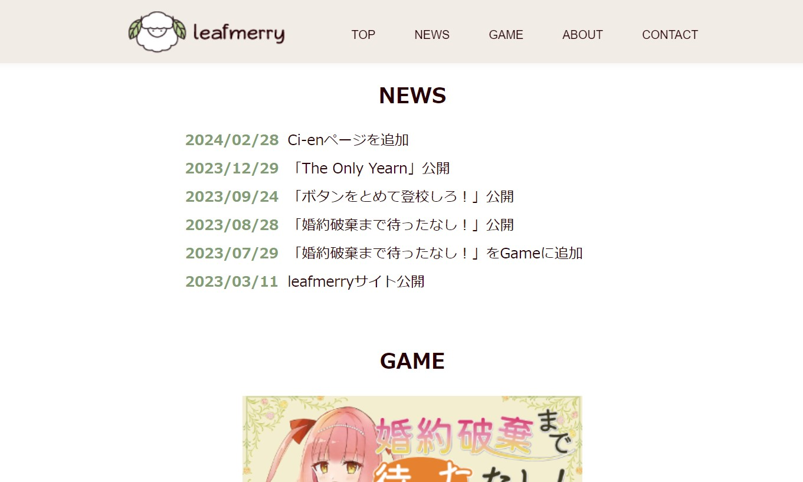
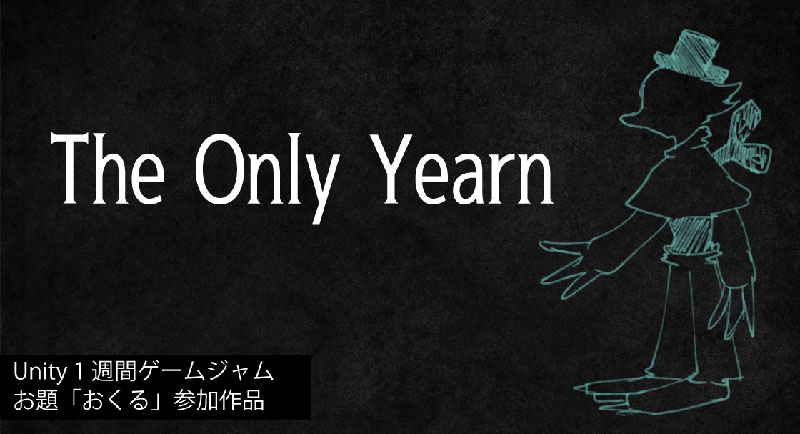

# しろ浜 ポートフォリオ  
※最終更新：2024年02月28日  
  
## 自己紹介  
- 名前：しろ浜
- 年齢：29歳  
- 大学卒業後、ソフトウェア・システム開発のIT企業に就職し、6年目になります。  
3年業務系（Windowsアプリ、Web）開発に携わった後、現職にて3D開発に携わりました。  
プライベートでもUnity開発を進めており、業務と相乗効果を生みながら活動しています。  

## 業務経験・スキル  
- C#が得意（3.1年）  
- React、TypeScriptを用いたフロントエンド開発が可能  
- Lambdaを用いたバックエンド開発が可能（業務では主にNode.jsを利用）  
- UnrealEngine5（14ヶ月）  
- WebVRプラットフォーム開発（7ヶ月）  
- Unityを用いたSNSプラットフォーム開発（3ヶ月）  

## 個人開発
### [個人サイト（クリックで開きます）](https://leafmerry.com)
  
[https://leafmerry.com](https://leafmerry.com)  
制作期間：2023年02月24日～2023年02月25日（2日間）  
言語、ライブラリ等：React、TypeScript、styled-components  
使用ツール等：VSCode、GitHub、Illustrator、PhotoShop、XD  

?>
スマートフォン向けにトレンドに合わせて1ページでの閲覧を考慮したデザイン  
UIコンポーネントフレームワークを用いず、フルスクラッチで実装  
レスポンシブ対応済  

### [ゲーム紹介動画（クリックで開きます）](https://drive.google.com/file/d/1Ce4aQAVLIwaDTGHEQKWqL3o27O5DziAX/view?usp=sharing)  
[https://drive.google.com/file/d/1Ce4aQAVLIwaDTGHEQKWqL3o27O5DziAX/view?usp=sharing](https://drive.google.com/file/d/1Ce4aQAVLIwaDTGHEQKWqL3o27O5DziAX/view?usp=sharing)  

!>音が出ます  

### [The Only Yearn（クリックで開きます）](https://unityroom.com/games/theonlyyearn)
  
[https://unityroom.com/games/theonlyyearn](https://unityroom.com/games/theonlyyearn)  
- 制作期間：2023年12月19日～2023年12月28日（10日間）  
- 言語、アセット等：C#（Unity）、Naninovel  
- 使用ツール等：Unity  

?>
Unity1週間ゲームジャム 第28回「おくる」参加作品  
就業中のため、退勤後や休日を活用し、シナリオ、グラフィック、プログラミングを担当  
BGM・SEは素材を借用  
最初にパラメータを設定し、設定したパラメータに応じて選択が変わるシナリオが魅力

### [ボタンをとめて登校しろ！（クリックで開きます）](https://unityroom.com/games/botatome)
  
[https://unityroom.com/games/botatome](https://unityroom.com/games/botatome)
- 制作期間：2023年9月18日～2023年9月24日（7日間）  
- 言語、ライブラリ等：C#（Unity）  
- 使用ツール等：、Illustrator、PhotoShop、Aseprite  

?>
Unity1週間ゲームジャム 第27回「１ボタン」参加作品  
就業中のため、退勤後や休日を活用し、シナリオ、グラフィック、プログラミングを担当  
BGM・SEは素材を借用  
指定の箇所をなぞるように見せてその実いかに範囲外を押さないかに早く気付けるかというゲーム  
カジュアルに挑戦できる点が魅力  

### [婚約破棄まで待ったなし！（クリックで開きます）](https://novelgame.jp/games/show/8579)
  
[https://novelgame.jp/games/show/8579](https://novelgame.jp/games/show/8579)
- 制作期間：2023年3月22日～2023年8月28日（約5ヶ月）  
- 言語、ライブラリ等：HTML、JavaScript、ティラノスクリプト  
- 使用ツール等：VSCode、Illustrator、PhotoShop、ClipStudio  

?>
ティラノゲームフェス2023参加作品  
就業中のため、退勤後や休日を活用し、シナリオ、グラフィック、プログラミングを担当  
BGM・SEは素材を借用 
ティラノスクリプト既存にはない、ノベルゲームのフローチャート機能をHTMLとJavaScriptを用いて自作  
マルチエンディングでほろ苦いエンディングもあるが、その分存在するハッピーエンドが魅力
